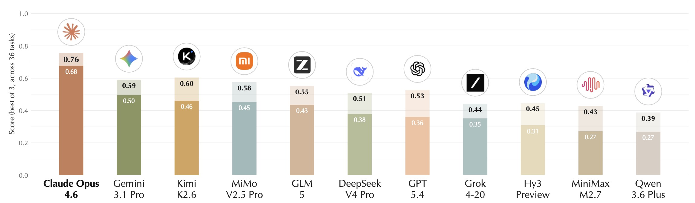
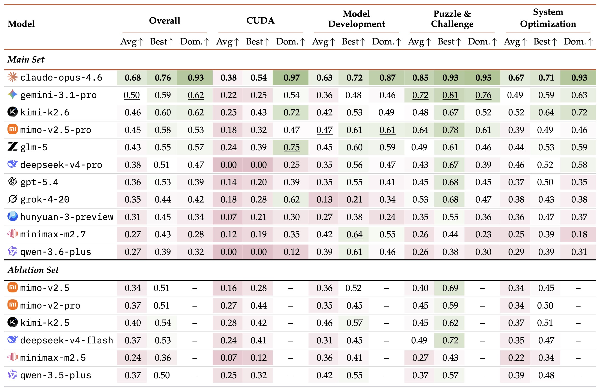

# 📈 AutoLab

AutoLab is a benchmark for evaluating AI agents on frontier auto research tasks. It presents 36 open-ended challenges spanning low-level systems optimization, CUDA kernel optimization, GPU-intensive model development, and puzzle-style algorithmic challenges, each with a real codebase, a compute budget, and a goal to optimize. Instead of measuring one-shot correctness, AutoLab tests what matters in practice: the ability to diagnose bottlenecks, formulate hypotheses, run experiments, and iteratively improve under realistic constraints.

- 🌐 **Website:** https://autolab.moe/
- 📝 **Paper (Arxiv):** https://arxiv.org/abs/2606.05080 
- 🏆 **Leaderboard:** https://autolab.moe/#leaderboard
- 💻 **GitHub:** https://github.com/autolabhq/autolab [You are here!]
- 📝 **Blog:** https://autolab.moe/blog
- 🔬 **Live Lab:** https://autolab.moe/live-lab (watch trajectory)

<p align="center">
  
</p>

## Leaderboard

The live AutoLab leaderboard is available at https://autolab.moe/. `Current version: v1.1 (2026.05.10)`

<p align="center">
  
</p>

<p align="center">
  
</p>

## Environment Setup

We utilize [Harbor](https://github.com/harbor-framework/harbor) to run and evaluate agent tasks in sandboxed containers. To install Harbor, simply:

```bash
uv sync
bash harbor_patch.sh  # enable gpu and extended waiting
```

### Reproducing Benchmark Results

We recommend using the following environments:

- **System Optimization:** To fully reproduce leaderboard experiments, please use AMD Ryzen 9 9950X with 64 GB memory. Differences in instruction set support across CPU generations can affect the maximum achievable speedup. Relative rankings and performance trends nevertheless remain informative.
- **CUDA:** requires H100 GPU access. We highly recommend [Modal](https://modal.com/) or other GPU-enabled container environments.
- **Model Development:** requires H100 or L40S GPU access; we highly recommend [Modal](https://modal.com/) or other GPU-enabled container environments.
- **Puzzle and Challenge:** no specific hardware environment is required.

## Task List

AutoLab consists of 36 scored tasks spanning four categories:

### Model Development (7 tasks)

- **data_select_ifeval** — Select the best 5,000 samples from a 50k pool to maximize instruction-following accuracy after LoRA fine-tuning. (Python/LlamaFactory)
- **flux2_klein_lora** — Train a LoRA adapter on FLUX.2 klein 9B DiT to maximize image/text quality under a fixed GPU budget. (Python/musubi-tuner)
- **grpo_multisource** — Fine-tune Qwen2.5-VL-7B with GRPO on multi-source visual math data to maximize MathVista accuracy. (Python/Unsloth)
- **llm_online_serving** — Optimize LLM online serving throughput and latency. (Python)
- **moving_mnist_world_model** — Train a video next-frame prediction model to maximize multi-step rollout PSNR on Moving MNIST. (Python/PyTorch)
- **multilingual_ocr** — Fine-tune DeepSeek-OCR-3B with LoRA to minimize character error rate on Persian and Bengali text. (Python/Unsloth)
- **scaling_law** — Train a GPT model from scratch on WikiText-103 to minimize perplexity within a fixed compute budget. (Python/LitGPT)

### System Optimization (15 tasks)

- **aes128_ctr** — Encrypt 256 MiB using AES-128-CTR as fast as possible. (C)
- **agent_tool_routing** — Route natural-language agent queries to the top-10 tool schemas as fast as possible while preserving retrieval quality. (Python)
- **bm25_search_go** — Execute BM25 ranking queries on a synthetic corpus as fast as possible. (Go)
- **bvh_raytracer** — Build a BVH and accelerate ray-triangle intersection for a 638×638 scene. (C++)
- **concurrent_kv_wal** — Optimize a WAL-backed key-value store with 4 concurrent goroutines. (Go)
- **fft_rust** — Compute DFT of a 32768-point real signal as fast as possible. (Rust)
- **flash_attention** — Compute scaled dot-product attention (n=4096, d=64) with cache-efficient tiling. (C)
- **gaussian_blur** — Apply a 17×17 Gaussian kernel to a 4K image (×5 passes) as fast as possible. (C)
- **hash_join** — Inner equi-join two tables (20k × 5M rows) as fast as possible. (C)
- **levenshtein_distance** — Compute exact edit distances over 1M string pairs as fast as possible. (C)
- **radix_sort** — Sort 50M random uint32s as fast as possible. (C)
- **regex_engine** — Compile regex patterns and search 100k haystacks as fast as possible. (Rust)
- **sha256_throughput** — Hash a 512 MiB buffer with SHA-256 as fast as possible. (C)
- **sstable_compaction_rs** — Optimize LSM-style SSTable compaction merging sorted runs. (Rust)
- **z_order_range_scan** — Optimize 2D rectangular range-count queries using a Rust spatial index. (Rust)

### Puzzle and Challenge (10 tasks)

- **adaptive_compression** — Build an adaptive byte-level predictor to minimize bits per byte across hidden sequence families. (Python)
- **adversarial_splay** — Construct key-access sequences that maximize rotations in a deterministic splay tree. (Python)
- **discover_sorting** — Find a 16-input sorting network with the fewest comparators. (Python)
- **fredkin_sort_network** — Build a 4-input stable sorting network using reversible gates with minimal gate count. (Custom)
- **resnet_bit_flip** — Find the smallest set of float32 bit flips that collapses MiniResNet CIFAR-10 accuracy below a threshold. (Python)
- **safety_router** — Train the smallest refusal router that satisfies private accuracy and recall gates. (Python)
- **smallest_game_player** — Train the smallest neural network (by parameter count) that achieves ≥95% accuracy on perfect-play Connect-3. (Python/PyTorch)
- **stack_machine_golf** — Compute a 256-element dot product minimizing executed instruction count on a stack machine. (Assembly)
- **toy_isa_opt** — Compute a 512-element dot product minimizing simulated cycle count on a toy ISA. (Assembly)
- **vliw_scheduler** — Pack a sequential instruction stream into VLIW bundles to minimize cycle count. (C)

### CUDA (4 tasks)

- **huffman_canonical_decode_cuda** — Decode many canonical-Huffman bitstreams on H100 with a custom CUDA kernel. (CUDA)
- **icp_correspondence_step_cuda** — Optimize one Iterative-Closest-Point correspondence step over large point clouds on H100. (CUDA)
- **msm_pippenger_bls12_381_cuda** — Compute BLS12-381 G1 multi-scalar multiplication with a custom CUDA implementation. (CUDA)
- **ntt_butterfly_cuda** — Apply a batched Number Theoretic Transform over the Goldilocks field on H100. (CUDA)

## Task Structure

Each task gives the agent:

- A working but unoptimized program (not a blank slate but a realistic starting point)
- A fixed compute budget and timeout (1–12 hours depending on task complexity)
- A target metric (throughput, latency, perplexity, accuracy, parameter count, etc.)
- A sandbox (with an H100 or L40S GPU if it requires model training or inference)

The agent must diagnose bottlenecks, propose interventions, execute them, measure results, and iterate — exactly as a human researcher would.

Each task is a self-contained environment with Harbor-compatible format:

```
tasks/<task_name>/
├── task.toml              # Metadata, scoring, resource limits
├── instruction.md         # Agent-facing problem description
├── environment/
│   ├── Dockerfile         # Reproducible container (pinned deps, offline data)
│   └── <editable files>   # The code the agent must optimize (e.g. solve.c, train.py)
├── solution/              # Private — invisible to the agent
│   ├── solve.sh           # Reference solution script
│   └── reference.md       # Full explanation of each optimization opportunity
└── tests/
    ├── test.sh            # Runs benchmark, computes reward, writes reward.json
    └── <verifier scripts> # Correctness checks
```

A typical task instruction:

```markdown
# Multi-Source Visual Math Reasoning via GRPO

Fine-tune Qwen2.5-VL-7B with GRPO to maximize accuracy on MathVista visual math problems.

## Setup

| Item | Path / Value |
|------|-------------|
| Training script | `/app/train.py` (editable) |
| Reward functions | `/app/rewards.py` (editable) |
| Training entrypoint | `bash /app/train.sh` |
| Local eval | `python3 /app/evaluate_local.py` |
| Base model | `/models/Qwen2.5-VL-7B-Instruct-bnb-4bit` (4-bit quantized) |

## Training Data Sources

| Dataset | Path | Size | Content |
|---------|------|------|---------|
| Geometry3K | `/data/geometry3k/` | ~2400 | Geometric reasoning with diagrams |
| MathVision | `/data/mathvision/` | ~2000 | Competition-level visual math |
| ChartQA | `/data/chartqa/` | ~1500 | Chart/graph understanding |

All datasets use a unified format: `question`, `answer`, `image`.

## Your Goal

Maximize `mathvista_accuracy` on 100 held-out MathVista problems. A retention gate applies: if general VQA accuracy drops more than 10% relative to the base model, the score is zero.

## Evaluation
python3 /app/evaluate_local.py   # quick check (20 MathVista + 10 VQA)

Reward = `your_score / reference_score`. Matching the reference scores 1.0.

## Rules

- Edit only `/app/train.py` and `/app/rewards.py`
- Do NOT modify `/orig/`, or `/models/`
- LoRA adapter must be saved to `/app/output/`
- No external network access
- Single L40S GPU (48GB)
- Time budget: 8 hours
```

## Scoring

`task.toml` defines a baseline and a human-written reference solution. AutoLab uses anchored scores, clipped to `[0, 1]`, with task-specific correctness or feasibility gates where needed:

**System Optimization and CUDA tasks:** Log-scaled speedup with a must-beat-baseline gate:

```
speedup = baseline / agent_score
reward  = clip(0.5 × log(speedup) / log(ref_speedup), 0, 1)
```

**Model Development tasks:** Linear interpolation between the baseline and reference anchors:

```
reward  = clip((agent_score - baseline) / (reference - baseline), 0, 1)   # higher-is-better
reward  = clip((baseline - agent_score) / (baseline - reference), 0, 1)   # lower-is-better
```

**Puzzle & Challenge tasks:** Most use anchored linear scoring; some tasks use log-stretch scoring or add task-specific feasibility gates.

These tasks do not share a single reward formula. Refer to each task's `task.toml` and test harness for the exact scoring rule.

## Usage

### Single Task

```bash
harbor run -p [task folder] -a terminus-2 -m [Your Model Name]
```

### All Tasks

```bash
harbor run -p ./tasks -a terminus-2 -m [Your Model Name]
```

Refer to [Harbor documentation](https://www.harborframework.com/) for detailed setups for more model providers and agent harnesses.

## Contribute

### Add Your Model & Harness & Tasks

We welcome new models, harnesses, and tasks. Open PR (new models or harnesses), we'll benchmark them on all tasks.

To submit a new task, please use our contribution portal at https://autolab.moe/live-lab/contribute so it can go through the proper review process. Our team will review and verify all submissions.

Please contact Zichen (zcc@stanford.edu) if you have any questions.

## Citation

If you use AutoLab in your research, please cite us:

```bibtex
@misc{autolab-2026,
  title         = {AutoLab: Can Frontier Models Solve Long-Horizon
                   Auto Research and Engineering Tasks?},
  author        = {Xu, Zhangchen and Chen, Junda and Huang, Yue and Jiang, Dongfu and
                   Chen, Jiefeng and Hua, Hang and Wu, Zijian and Liu, Zheyuan and
                   He, Zexue and Li, Lichi and Diao, Shizhe and Pei, Jiaxin and
                   Yoon, Jinsung and Zhang, Hao and Wang, Mengdi and Poovendran, Radha and
                   Sra, Misha and Pentland, Alex and Chen, Zichen},
  year          = {2026},
  eprint        = {2606.05080},
  archivePrefix = {arXiv},
  primaryClass  = {cs.AI},
  url           = {https://arxiv.org/abs/2606.05080}
}
```
